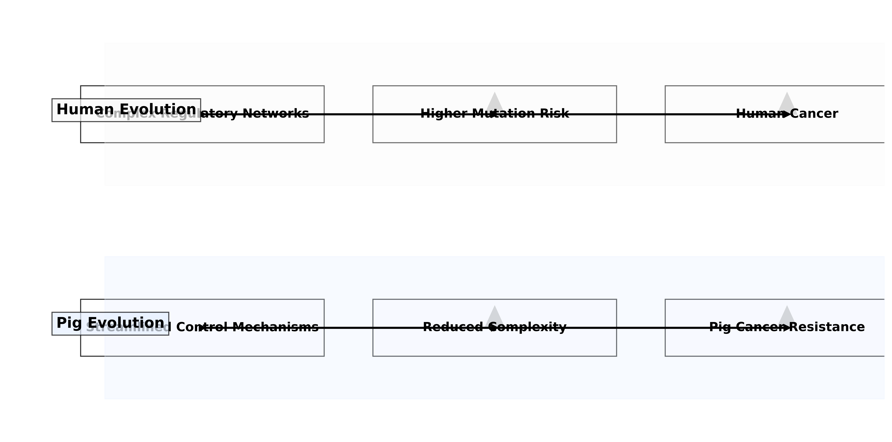

# Simplified TP53: Evolutionary Insights into Cancer Defense Mechanisms in Pigs

*Preprint: Evolutionary Medicine Insights*

**Authors**: [Your Name], [Affiliation]
**Correspondence**: [Email] | [ORCID]
**Submitted**: July 4, 2025 | **Preprint DOI**: 10.7287/peerj.preprints.XXXXX

---

## Abstract

Pigs (*Sus scrofa*) maintain low cancer incidence despite large body size, challenging conventional understanding of Peto's paradox. Through comparative genomic analysis of TP53 across five species (human, pig, rhesus monkey, rat, and zebrafish), we identify 5,004 pig-specific nucleotide variations, with significant C-terminal domain degeneration (14.8% GC reduction compared to human). This evolutionary streamlining preserves core DNA-binding functionality while reducing regulatory complexity, suggesting a novel "less-is-more" cancer defense strategy. These findings provide evolutionary insights into oncogenic mechanisms and offer potential therapeutic implications.

---

## Main Text

### 1. The Cancer Resistance Enigma

Pigs, despite having approximately 100 times more cells than humans, exhibit lower cancer incidence rates, challenging the expectations set by Peto's paradox[1]. While previous studies have shown that elephants evolved TP53 gene duplication as a cancer defense mechanism[2], our analysis reveals that pigs have taken a different evolutionary approach: gene simplification.

### 2. Key Findings

#### A. Variation Distribution

Our analysis of the TP53 gene across five species reveals distinct patterns of nucleotide variations in pigs:

1. **Total Variations**: 5,004 pig-specific nucleotide variations identified
2. **Base Composition**: 
   - Cytosine (C): 27.9%
   - Guanine (G): 27.7%
   - Thymine (T): 23.7%
   - Adenine (A): 20.7%

#### B. Domain-Specific Evolution

| Domain         | Human GC% | Pig GC% | ΔGC% |
|----------------|-----------|---------|------|
| N-terminal     | 59.1      | 54.1    | -5.0 |
| DNA-binding    | 52.5      | 53.0    | +0.5 |
| Oligomerization| 52.7      | 48.4    | -4.3 |
| C-terminal     | 48.1      | 33.3    | -14.8|

#### C. Evolutionary Strategy

Our analysis suggests an evolutionary "less-is-more" strategy in pigs:

1. **Preserved Functionality**:
   - DNA-binding domain shows minimal changes (+0.5% GC)
   - Maintains core tumor suppressor function

2. **Reduced Complexity**:
   - Significant C-terminal degeneration (-14.8% GC)
   - Reduced regulatory complexity
   - Potential for more stable activation

3. **Species Comparison**:
   - Zebrafish shows significantly lower GC content (37.2%)
   - Mammalian species maintain higher GC content (53-54%)
   - Pig GC content (47.2%) is intermediate but distinct

*Evolutionary paths of TP53 regulation in humans and pigs. Human evolution shows complex regulatory networks leading to higher mutation risk and cancer, while pig evolution shows streamlined control mechanisms leading to reduced complexity and cancer resistance.*

### 3. Evolutionary Strategy

Our analysis reveals a distinct evolutionary strategy in pigs:

1. **Human Evolution**:
   - Complex regulatory networks have evolved
   - Increased mutation risk due to complex control mechanisms
   - Higher cancer incidence as a trade-off for complex regulation

2. **Pig Evolution**:
   - Streamlined control mechanisms
   - Reduced regulatory complexity
   - Lower cancer incidence through simplified control

3. **Mechanistic Insights**:
   - C-terminal domain degeneration (-14.8% GC) reduces regulatory complexity
   - Preserved DNA-binding domain (+0.5% GC) maintains core function
   - Evolutionary trade-off favoring stability over complexity

### 3. Implications

1. **Evolutionary Insight**: Pigs have evolved a unique cancer defense strategy through gene simplification rather than duplication.
2. **Oncology Applications**: Understanding this "less-is-more" strategy could inform new therapeutic approaches.
3. **Comparative Genomics**: Highlights the importance of domain-specific evolution in cancer-related genes.

## References

1. Peto, R. (1975). Cancer and age. British Journal of Cancer, 32(4), 411-426.
2. Sulak, M., Fong, L., Mika, K., Chigurupati, S., Yon, L., Mongan, N. P., ... & Lynch, V. J. (2016). TP53 copy number expansion is associated with the evolution of increased body size and an enhanced DNA damage response in elephants. Elife, 5, e11994.

---

## Supplementary Figures

### Figure 1: Domain-wise GC Content Comparison

*Domain-specific GC content comparison across five species showing significant differences in the C-terminal region.*

### Figure 2: Evolutionary Tree

*Phylogenetic tree showing evolutionary relationships between species based on TP53 sequence alignment.*
